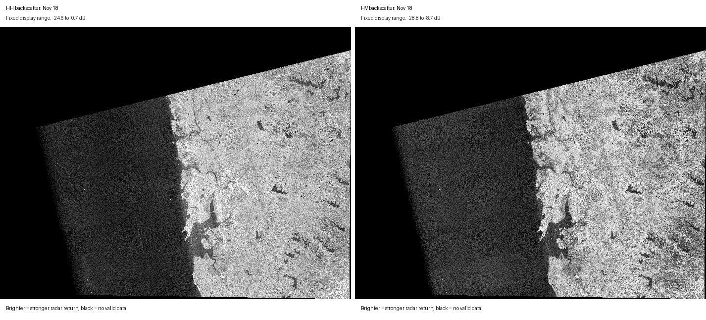
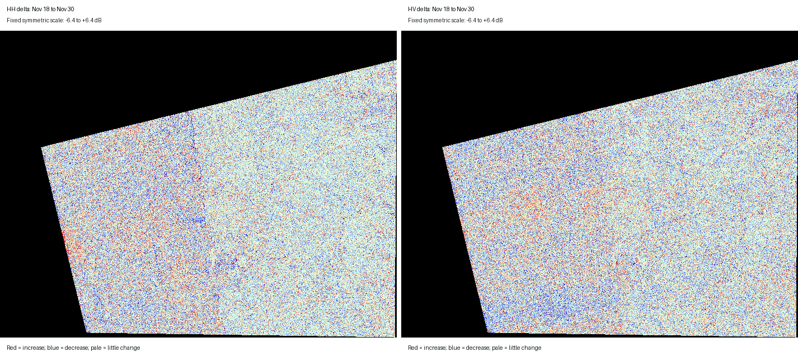

# NISAR GCOV Change Analysis

This project compares four NISAR Level-2 GCOV acquisitions over ascending path
113, frame 11, focusing on Mumbai in western India and the adjacent Arabian Sea:

- November 18, 2025
- November 30, 2025
- December 24, 2025
- January 5, 2026

The analysis converts HH and HV covariance terms to decibels, measures
interval-to-interval change, summarizes a selected polygon, and produces
animations with fixed display scales.

## Visual Results

### HH and HV through time



### Interval deltas



In the delta animation, red indicates increased radar backscatter, blue
indicates decreased backscatter, and pale colors indicate relatively little
change. HH is shown on the left and HV on the right.

## Main Findings

Across November 18 to January 5, mean backscatter within the analysis polygon
declined by approximately:

- `0.31 dB` in HH
- `0.41 dB` in HV

Most changes were localized rather than evidence of a single scene-wide event.
Strong rectangular patterns over the sea are consistent with pre-calibration
processing artifacts and should not be interpreted as environmental change.

## Data

The raw NISAR HDF5 products are not committed because each file is roughly
6 GB. Download them from [ASF Data Search](https://search.asf.alaska.edu/)
using a free NASA Earthdata Login.

Expected filenames:

```text
NISAR_L2_PR_GCOV_005_113_A_011_4005_DHDH_A_20251118T003447_20251118T003522_X05009_N_F_J_001.h5
NISAR_L2_PR_GCOV_006_113_A_011_4005_DHDH_A_20251130T003448_20251130T003522_X05010_F_F_J_001.h5
NISAR_L2_PR_GCOV_008_113_A_011_4005_DHDH_A_20251224T003449_20251224T003523_X05009_N_F_J_001.h5
NISAR_L2_PR_GCOV_009_113_A_011_4005_DHDH_A_20260105T003449_20260105T003524_X05009_N_F_J_001.h5
```

## Setup

```bash
python3 -m venv .venv
source .venv/bin/activate
python -m pip install -r requirements.txt
```

## Run

Create full-resolution GeoTIFFs for the first pair:

```bash
python analyze_nisar_gcov_pair_streaming.py \
  NISAR_L2_PR_GCOV_005_113_A_011_4005_DHDH_A_20251118T003447_20251118T003522_X05009_N_F_J_001.h5 \
  NISAR_L2_PR_GCOV_006_113_A_011_4005_DHDH_A_20251130T003448_20251130T003522_X05010_F_F_J_001.h5
```

Create the four-date polygon summary and overview:

```bash
python analyze_nisar_gcov_timeseries.py
```

Create the animated visualizations:

```bash
python make_nisar_gcov_gifs.py
```

## Important Caveat

These are pre-calibration NISAR products. Radiometric banding, radio-frequency
interference, edge effects, and differences between processing releases can
resemble real change. The outputs identify radar-observed change candidates;
they do not by themselves establish flooding, crop activity, soil-moisture
change, or another physical cause.

See the [ASF NISAR GCOV guide](https://nisar-docs.asf.alaska.edu/gcov/) and
[known product issues](https://nisar-docs.asf.alaska.edu/product-known-issues/).
